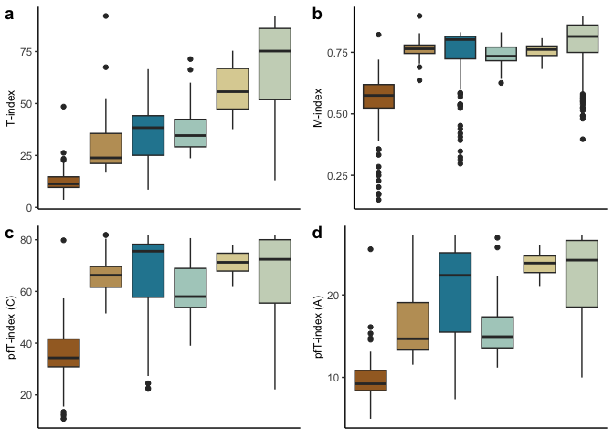
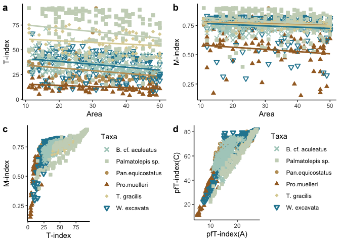

Testing metrics for crystallographic order
================
Bryan Shirley, with edits by Emilia Jarochowska
2023-11-19

The data files are downloaded from Open Science Framework:

``` r
source("../get_data_from_osf.R")
get_data_from_osf(link = "https://osf.io/vnq6s/")
```

    ## Requesting folder 'Data Files' from OSF

    ## Downloaded 1 file(s) from OSF folder 'Data Files'

``` r
Data = read.csv("Data Files/TextureResults.csv",header = T, sep=';')
```

## All the methods

Here we plot 3 methods of looking at the texture index of materials.
First, we use the Texture Index (TI), followed by the misorientation
index (M-index) and then the pole figure texture index (pfT-index) for
the A and C axis.

<!-- -->

## Comparing methods

Here we use scatter plots to compare the difference between the M-index
and the T Index

## Big combi plot

This is just a combination plot of the above data.

<!-- -->

## How do values change with area?

It appears that area does have an impact on the TI values, however, the
M-index does not have the resolution to decipher the differences between
taxa.

## Composite plot used in Extended Data

    ## `geom_smooth()` using formula = 'y ~ x'
    ## `geom_smooth()` using formula = 'y ~ x'

<!-- -->

## Regression analysis

Using linear regression to explore the relationship between TI and area:

``` r
source("overall_p.R")
source("regression.R")
Regression_results <- regression(unique(Data$Taxa))
```

|        |                  |           |                    |
|:-------|:-----------------|:----------|:-------------------|
| output | Taxon            | R-squared | p-value            |
|        | Pro.muelleri     | 0.042     | 0.032602083620642  |
|        | Pan.equicostatus | 0.061     | 0.0114021274228829 |
|        | W. excavata      | 0.071     | \< 0.005           |
|        | B. cf. aculeatus | 0.059     | \< 0.005           |
|        | T. gracilis      | 0.022     | 0.0948408776914293 |
|        | Palmatolepis sp. | 0.021     | 0.0286544595126042 |
