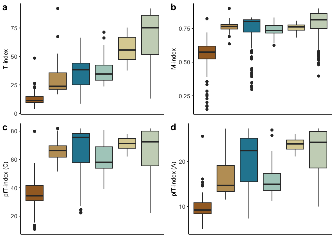

Testing metrics for crystallographic order
================
Bryan Shirley and Emilia Jarochowska
2023-01-14

The data files are downloaded from Open Science Framework.

## All the methods

Here we plot 3 methods of looking at the texture index of materials.
First, we use the Texture Index (TI), followed by the misorientation
index (M-index) and then the pole figure texture index (pfT-index) for
the A and C axis.

<!-- -->

## Big combi plot

This is just a combination plot of the above data.

<!-- -->

## Composite plot used in Extended Data

    ## `geom_smooth()` using formula = 'y ~ x'
    ## `geom_smooth()` using formula = 'y ~ x'

<!-- -->

## Regression analysis

Using linear regression to explore the relationship between TI and area:

|                  |           |                    |
|:-----------------|:----------|:-------------------|
| Taxon            | R-squared | p-value            |
| Pro.muelleri     | 0.042     | 0.032602083620642  |
| Pan.equicostatus | 0.061     | 0.0114021274228829 |
| W. excavata      | 0.071     | \< 0.005           |
| B. cf. aculeatus | 0.059     | \< 0.005           |
| T. gracilis      | 0.022     | 0.0948408776914293 |
| Palmatolepis sp. | 0.021     | 0.0286544595126042 |
