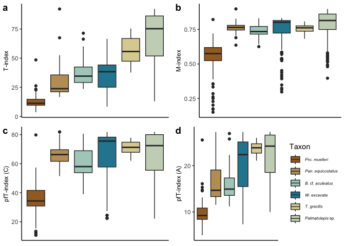

Testing metrics for crystallographic order
================
Bryan Shirley and Emilia Jarochowska
2024-04-28

The data files are downloaded from Open Science Framework. This needs to
be done only once.

``` r
# Set eval = F to prevent this code chunk from downloading data every time
source("../get_data_from_osf.R")
get_data_from_osf(link = "https://osf.io/vnq6s/")
```

Once a copy of the dataset is on the local computer, it can be imported
into R:

``` r
Data = read.csv(file = "Data Files/TextureResults.csv",
                header = T, 
                sep=';')
Data$Taxa <- factor(Data$Taxa, 
                    levels = c("Pro.muelleri", "Pan.equicostatus", "B. cf. aculeatus", "W. excavata", "T. gracilis", "Palmatolepis sp."))
```

## All the methods

Here we plot 3 methods of looking at the texture index of materials.
First, we use the Texture Index (TI), followed by the misorientation
index (M-index) and then the pole figure texture index (pfT-index) for
the A and C axis.

``` r
boxplots <- ggpubr::ggarrange(p1, p2,p3,p4,
                  labels = c("a", "b", "c","d"),
                  ncol = 2, nrow = 2)
boxplots
```

<!-- -->

## Big combi plot

A combination plot of the texture index comparison.

``` r
composite <- ggarrange(ggarrange(TI_area, MI_area, ncol = 2, labels = c("a", "b")),
          ggarrange(sc1, sc2, ncol = 2, labels = c("c", "d")),
          nrow = 2, 
          labels = "a")
```

    ## `geom_smooth()` using formula = 'y ~ x'
    ## `geom_smooth()` using formula = 'y ~ x'

``` r
composite
```

<!-- -->

## Regression analysis

Using linear regression to explore the relationship between TI and area:

|       |           |                    |
|:------|:----------|:-------------------|
| Taxon | R-squared | p-value            |
| 1     | 0.042     | 0.032602083620642  |
| 2     | 0.061     | 0.0114021274228829 |
| 4     | 0.071     | \< 0.005           |
| 3     | 0.059     | \< 0.005           |
| 5     | 0.022     | 0.0948408776914293 |
| 6     | 0.021     | 0.0286544595126042 |
